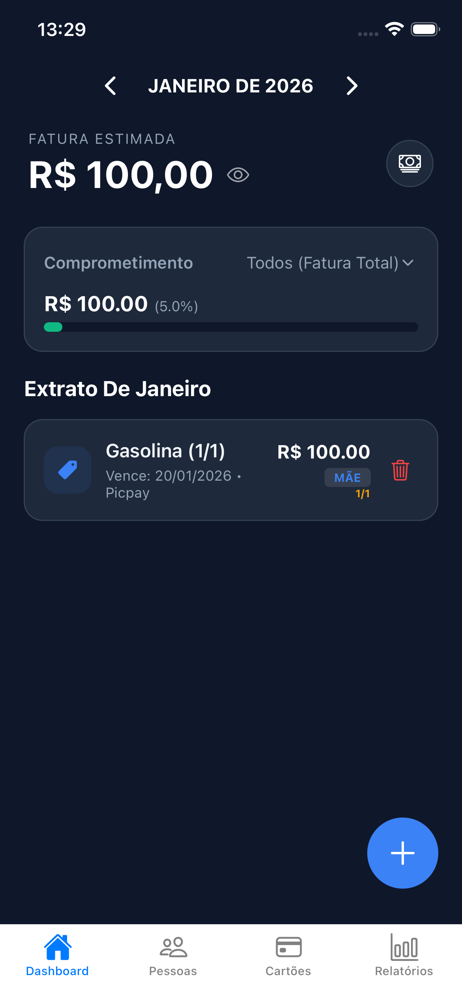
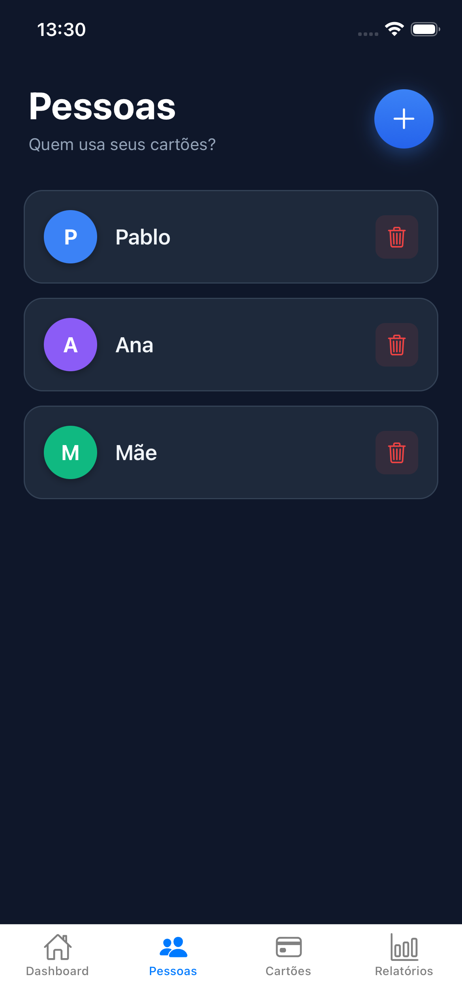
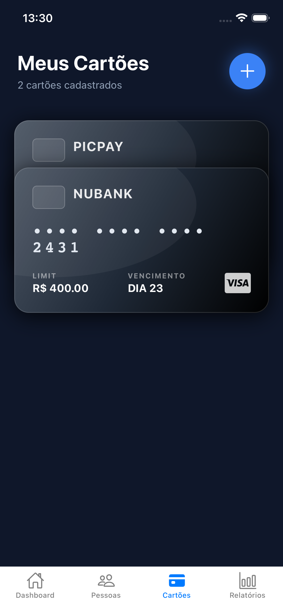

# 💳 Me Pague - Engenharia Financeira & Gestão de Crédito Pessoal

> **Versão:** 1.0.1 (Stable)
> **Status:** 🚀 Em Produção (Fase Beta)

O **Me Pague** não é apenas um gestor de despesas; é uma aplicação de engenharia financeira desenhada para resolver a complexidade da partilha de cartões de crédito. O sistema implementa regras de negócio avançadas para **projeção de faturas**, **cálculo de juros rotativos** e **rateio de despesas** entre dependentes, garantindo integridade de dados e segurança de nível bancário.

## ✨ Destaques de Engenharia

### 🛡️ Segurança Biométrica (Nível Bancário)
Implementação robusta utilizando `expo-local-authentication` com verificação em duas etapas:
- **Hardware & Enrollment Check:** O app verifica se o dispositivo possui hardware seguro e se há biometria registada antes de tentar autenticar.
- **Fail-Safe Logic:** Sistema de proteção que impede a renderização das rotas autenticadas (`NavigationContainer`) até que a promessa biométrica seja resolvida com sucesso (`isBiometricAuthenticated`).
- **iOS & Android Compliant:** Tratamento específico para FaceID (iOS) e Fingerprint (Android), incluindo fallback para PIN do dispositivo caso a biometria falhe repetidamente.

### ⚛️ Integridade de Dados (ACID)
Utilização intensiva de `runTransaction` do Firestore para garantir consistência financeira:
- **Atomicidade:** O débito do limite do cartão e a criação da despesa ocorrem numa única transação atómica. Se um falhar, o outro é revertido instantaneamente.
- **Prevenção de Race Conditions:** Uso de `increment` atómico para atualizações de saldo, permitindo que múltiplos utilizadores lancem despesas simultaneamente sem corromper o valor final da fatura.

### 📱 UI/UX Adaptativa (Safe Area)
Arquitetura de interface desenhada para dispositivos modernos:
- **Safe Area Context:** O app adapta-se automaticamente a "Notches", "Dynamic Islands" e barras de gestos utilizando `SafeAreaProvider` e `SafeAreaView`.
- **Custom TabBar:** Navegação inferior personalizada com deteção de SO (`Platform.OS`), ajustando altura (`95px` iOS / `70px` Android) e áreas de toque para evitar conflitos com gestos do sistema.
- **Modo Dark Premium:** Paleta de cores estudada para conforto visual noturno (`#0f172a` background / `#1e293b` surfaces).

## 🚀 Funcionalidades Core

* **Motor de Parcelamento:** Algoritmo que projeta automaticamente lançamentos futuros, respeitando a virada do mês e o dia de vencimento do cartão.
* **Smart Billing:** Lógica que decide automaticamente se uma compra entra na fatura atual ou na próxima, baseada no "Melhor Dia de Compra".
* **Gestão de Dependentes:** Controle granular de quem gastou o quê. O sistema calcula individualmente a dívida de cada "Pessoa" associada à fatura.
* **Pagamento com Resíduo:** Ao pagar uma fatura parcialmente, o sistema calcula automaticamente o restante, aplica os juros configurados e lança o valor na fatura do mês seguinte.

## 🛠️ Stack Tecnológico

* **Core:** React Native (Expo SDK 50)
* **Linguagem:** TypeScript (Strict Typing)
* **Backend:** Firebase Firestore (NoSQL)
* **Auth:** Firebase Authentication + Biometria Local
* **State Management:** Context API (Auth Flow)
* **UI Libs:** React Native Safe Area Context, Vector Icons, Masked Text

## 📸 Screenshots

<div style="display: flex; flex-direction: row; overflow-x: auto; gap: 15px;">
  
  
  
  
</div>

## 👷 Como Rodar o Projeto

### Pré-requisitos
- Node.js (LTS)
- Conta no Firebase configurada

### Instalação

1. **Clone o repositório:**
   ```bash
   git clone [https://github.com/Caiozmartins/me-pague-App.git](https://github.com/Caiozmartins/me-pague-App.git)
   cd me-pague-App

2. **Instale as dependências:**

Bash
npm install

**O projeto utiliza dependências nativas (expo-local-authentication). Se utilizar o Expo Go, certifique-se de que é compatível, ou gere um Development Build.**

3. **Configure o Ambiente:**

Crie o arquivo src/config/firebaseConfig.ts com as suas chaves de API.
**
4. **Execute:**

Bash
npx expo start

👨‍💻 Autor
Desenvolvido por Caio Martins Estudante de Engenharia de Software - UCB

"Software é sobre resolver problemas complexos com soluções elegantes."