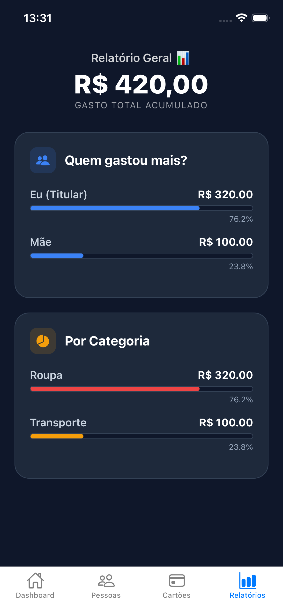

# 💳 Me Pague - Controle Financeiro Inteligente

O **Me Pague** é um aplicativo de gestão de despesas focado em cartões de crédito, ideal para quem compartilha cartões com familiares ou amigos. O app não apenas registra gastos, mas entende a lógica de fechamento de faturas e organiza o comprometimento financeiro de cada pessoa envolvida.

## 🚀 Funcionalidades Principais

* **Lógica de Fatura Inteligente:** O app calcula automaticamente se uma compra cairá na fatura atual ou na próxima, baseando-se no dia de fechamento do cartão.
* **Parcelamento Automático:** Ao lançar uma compra parcelada, o app projeta as faturas dos meses seguintes, alinhando-as sempre ao dia de vencimento do cartão.
* **Gestão de Dependentes:** Controle quem gastou o quê. Perfeito para saber quanto cada pessoa deve pagar na fatura total.
* **Barra de Comprometimento:** Visualize quanto do seu orçamento (ou de uma pessoa específica) já foi consumido no mês atual.
* **Modo Dark Premium:** Interface moderna e confortável para uso em qualquer iluminação.

## 🛠️ Tecnologias Utilizadas

* **React Native / Expo:** Desenvolvimento mobile cross-platform.
* **Firebase (Firestore):** Banco de dados em tempo real para sincronização de despesas.
* **Firebase Auth:** Autenticação segura de usuários.
* **Context API:** Gerenciamento de estado global (Autenticação).
* **React Navigation:** Navegação fluida entre telas.

## 📸 Demonstração




## 👷 Como Executar o Projeto

1. Clone o repositório:
   ```bash
   git clone [https://github.com/Caiozmartins/me-pague-App.git](https://github.com/Caiozmartins/me-pague-App.git)

2. Instale as dependências:
    npm install

3. Inicie o projeto:
    npx expo start

    Desenvolvido por Caio Martins - Estudante de Engenharia de Software na UCB.